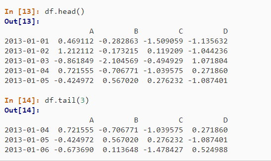
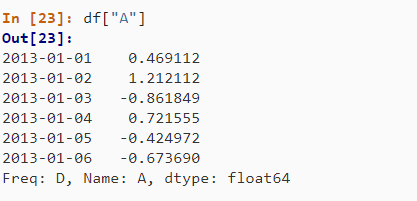
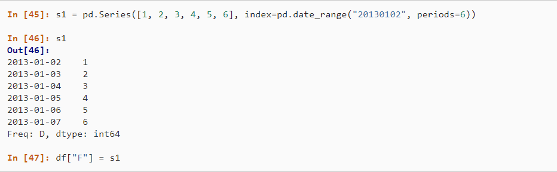

# Pandas
Pandas is used to create different data structures like `series` and `data frames`, these data structures can be indexed and viewed using Pandas, also Pandas help in selecting and changing values from these data structures.

## Examples:
- Creting a `series`:
>  

- View data:

    > 

- Getting data:

    > 

- Setting data:

    > 

Also different operations can be applied like statistical operations, merging, applying functions on data and more, a more comprehensive discussion can be found on [pandas](https://pandas.pydata.org/pandas-docs/stable/user_guide/10min.html)