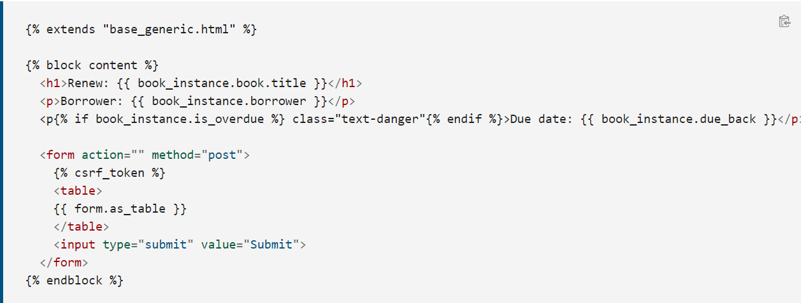

# Django CRUD and Forms
Django provides an easy and secure way to create forms, forms are HTML elements used to collect user data, to create a form first import `forms` from `django`

    from django import forms

    class RenewBookForm(forms.Form):
        renewal_date = forms.DateField(help_text="Enter a date between now and 4 weeks (default 3).")

As you saw, the data type for renewal_date is `DateField`, fields of the form can have any type you know like BooleanField, CharField,...etc.

## Form Template

...to be continued