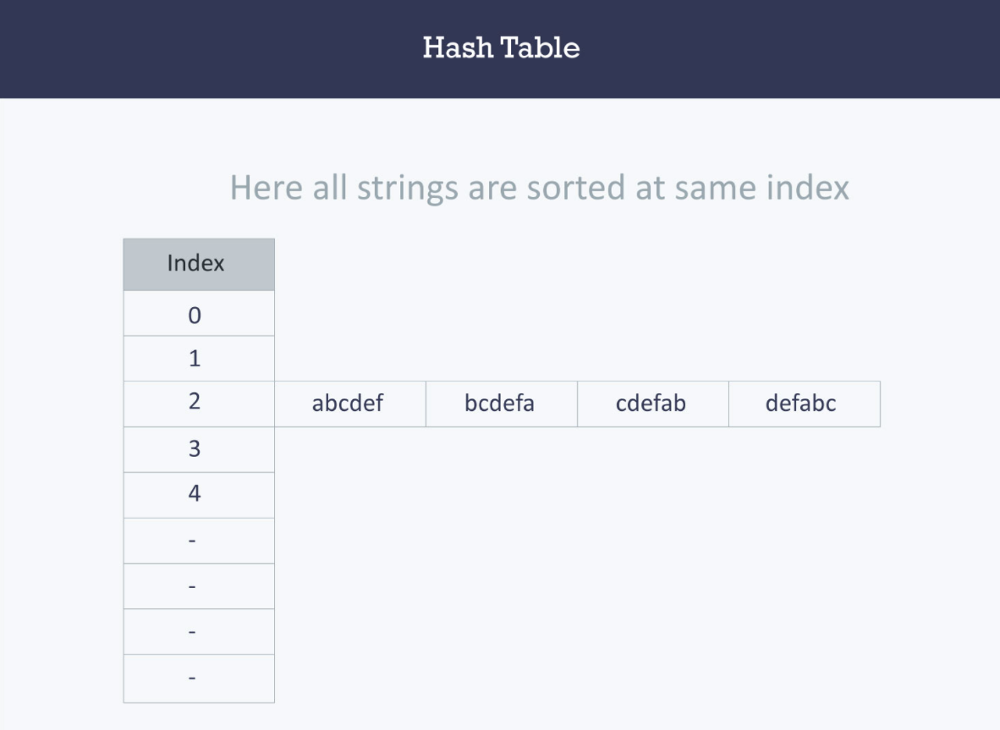

# Hashtables
It is a data structure which makes it easier to search for values, each value has its hash, when searching for a value, an algorithm (hash algorithm) will turn it to its hash value and then retrieve it immediately.

>In hashing, large keys are converted into small keys by using hash functions. The values are then stored in a data structure called hash table. The idea of hashing is to distribute entries (key/value pairs) uniformly across an array. Each element is assigned a key (converted key). By using that key you can access the element in O(1) time. Using the key, the algorithm (hash function) computes an index that suggests where an entry can be found or inserted.

Examples for hash functions and how they are written can be found [here](https://www.hackerearth.com/practice/data-structures/hash-tables/basics-of-hash-tables/tutorial/)